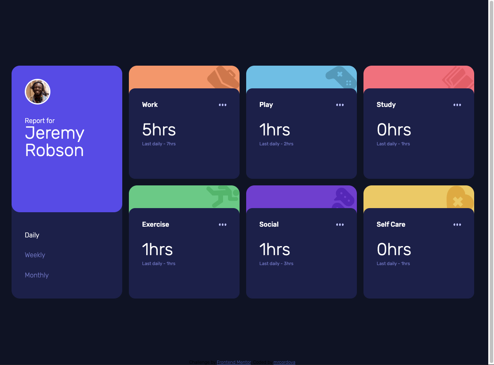

# Frontend Mentor - Time tracking dashboard solution

This is a solution to the [Time tracking dashboard challenge on Frontend Mentor](https://www.frontendmentor.io/challenges/time-tracking-dashboard-UIQ7167Jw). Frontend Mentor challenges help you improve your coding skills by building realistic projects.

## Table of contents

- [Overview](#overview)
  - [The challenge](#the-challenge)
  - [Screenshot](#screenshot)
  - [Links](#links)
- [My process](#my-process)
  - [Built with](#built-with)
  - [What I learned](#what-i-learned)
  - [Continued development](#continued-development)
  - [Useful resources](#useful-resources)
- [Author](#author)

## Overview

### The challenge

Users should be able to:

- View the optimal layout for the site depending on their device's screen size
- See hover states for all interactive elements on the page
- Switch between viewing Daily, Weekly, and Monthly stats

### Screenshot

### Links

- Solution URL: [Github repp](https://github.com/mrcordova/time-tracking-dashboard-main)
- Live Site URL: [Github page](https://mrcordova.github.io/time-tracking-dashboard-main/)

## My process

### Built with

- Semantic HTML5 markup
- CSS custom properties
- Flexbox
- CSS Grid
- Mobile-first workflow

### What I learned

I learned how to work with css grid and flexbox together. I also learned how to have multiple hover effects on a parent and child element.

### Continued development

I will like to continue to learn about CSS Grid and how to make it more responsive.

### Useful resources

- [RegExp: remove whitespace](https://stackoverflow.com/questions/7151159/javascript-regular-expression-remove-spaces) - I was having trouble working with RegExp.

- [Get value of checkbox](https://stackoverflow.com/questions/11599666/get-the-value-of-checked-checkbox) - I wasn't sure what the syntax for getting the checked element in radio buttons.

- [Window onload vs Documnt onload](https://stackoverflow.com/questions/588040/window-onload-vs-document-onload) - I was wondering what the difference of the two were and if it mattered.

- [How to create the brightness effect](https://stackoverflow.com/questions/53682577/how-to-make-any-hovered-color-darker-lighter-that-the-original) - I didn't know you could create the lighter color effect by just changing the brighness.

- [Regex generator](https://regex-generator.olafneumann.org/?sampleText=self%20care&flags=Pi) - I wasn't sure if I was creating the correct regex.

## Author

- Website - [mrcordova](https://github.com/mrcordova)
- Frontend Mentor - [@mrcordova](https://www.frontendmentor.io/profile/mrcordova)
